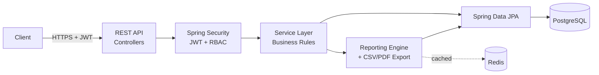

# Retail Reporting System

A production-style backend for retail product, inventory, customer, order, and
**reporting/analytics** management - built as a portfolio-grade demonstration of
backend engineering, system design, and data engineering practices, not a tutorial CRUD
app.

[](https://github.com/gowrisankar-t/retail-reporting-system/actions/workflows/ci.yml)
[](LICENSE)
[](https://openjdk.org/)
[](https://spring.io/projects/spring-boot)

> Replace the CI badge URL above with your actual GitHub `owner/repo` path once pushed.

## What This Is

A single retailer's backend system exposing a versioned REST API over a normalized
PostgreSQL schema, with:

- **Auth**: JWT access/refresh tokens, BCrypt password hashing, role-based access
  control (`ADMIN`, `MANAGER`, `ANALYST`, `VIEWER`).
- **Core domain**: categories, products (+ inventory), customers, orders (+ line items),
  with transactional, stock-safe order placement.
- **Reporting engine**: sales summary, revenue trend, top products, top customers,
  low-stock alerts, and a cached KPI dashboard - every report exportable as CSV or PDF.
- **Cross-cutting concerns done properly**: centralized validation and error handling,
  structured request logging with correlation IDs, Redis caching, Actuator health/metrics,
  OpenAPI/Swagger docs, Dockerized deployment, CI, and a real test suite.

See [`docs/requirements.md`](docs/requirements.md) for the full functional/non-functional
requirements and [`docs/architecture.md`](docs/architecture.md) for the system design
(with Mermaid diagrams: component, sequence, data flow, deployment, ERD) and the
rationale behind every major decision.

## Tech Stack

| Layer | Choice | Why |
|---|---|---|
| Language / Runtime | Java 17, Spring Boot 3.2 | Mature, strongly-typed, industry-standard for backend services at this scale |
| Persistence | PostgreSQL 16, Spring Data JPA / Hibernate | Strong relational integrity fits a naturally relational retail domain |
| Migrations | Flyway | Versioned, reviewable schema changes; no `ddl-auto` outside tests |
| Auth | JWT (jjwt) + Spring Security | Stateless, horizontally scalable, no server-side session store |
| Caching | Redis | Survives restarts, shared across instances (unlike an in-process cache) |
| API docs | springdoc-openapi / Swagger UI | Auto-generated from annotated controllers, always in sync with the code |
| PDF export | openhtmltopdf | Permissive license; renders hand-built XHTML, no commercial PDF licensing |
| CSV export | Apache Commons CSV | RFC 4180-correct quoting/escaping |
| Testing | JUnit 5, Mockito, Spring Boot Test, H2 | Fast unit tests + real Spring-context integration tests with zero external services |
| Build | Maven | Ubiquitous, first-class Spring Boot support |
| CI/CD | GitHub Actions | Free for public repos, tight GitHub integration |
| Containerization | Docker (multi-stage), Docker Compose | Identical artifact from dev to prod; compose wires up Postgres + Redis locally |

Full stack rationale: [`docs/architecture.md`](docs/architecture.md#3-technology-stack-rationale).

## Architecture at a Glance



Full diagrams (component, sequence, deployment, ERD): [`docs/architecture.md`](docs/architecture.md).

## Quick Start

### Option A: Docker Compose (recommended - zero local setup)

```bash
git clone https://github.com/<you>/retail-reporting-system.git
cd retail-reporting-system
cp .env.example .env
# Edit .env and set a real JWT_SECRET: openssl rand -base64 64

docker compose up --build
```

The API is now live at `http://localhost:8080`. Swagger UI: `http://localhost:8080/swagger-ui.html`.

Flyway seeds four demo accounts (see [`docs/api.md`](docs/api.md#demo-accounts) for the
full list and passwords) plus a realistic sample dataset (15 products, 10 customers, 60
orders spanning six months) so every report has real data to show immediately.

### Option B: Run locally with Maven

Prerequisites: JDK 17, Maven 3.9+, a running PostgreSQL 16 and Redis 7 (or point the
`DB_*`/`REDIS_*` env vars at existing instances).

```bash
export $(grep -v '^#' .env.example | xargs)   # or export your own values
mvn spring-boot:run
```

### Try it

```bash
# Log in as the seeded manager account
curl -s -X POST http://localhost:8080/api/v1/auth/login \
  -H "Content-Type: application/json" \
  -d '{"email":"manager@retail-reporting.local","password":"Manager@12345"}' | tee /tmp/login.json

TOKEN=$(python3 -c "import json;print(json.load(open('/tmp/login.json'))['accessToken'])")

# Cached KPI dashboard
curl -s http://localhost:8080/api/v1/dashboard/summary -H "Authorization: Bearer $TOKEN"

# Top 5 products by revenue, last 6 months, as CSV
curl -s "http://localhost:8080/api/v1/reports/top-products?start=2026-01-01T00:00:00&end=2026-07-07T00:00:00&limit=5&sortBy=revenue&format=csv" \
  -H "Authorization: Bearer $TOKEN" -o top-products.csv
```

A ready-to-import Postman collection covering every endpoint (with pre-request
scripts that auto-populate the auth token) is at
[`postman/retail-reporting-system.postman_collection.json`](postman/retail-reporting-system.postman_collection.json).

## Project Structure

```
retail-reporting-system/
├── src/main/java/com/gowrisankar/retailreporting/
│   ├── config/         Security, cache, CORS, OpenAPI, logging config
│   ├── security/       JWT service, auth filter, UserDetails adapter
│   ├── domain/entity/  JPA entities (Category, Product, Inventory, Customer, Order...)
│   ├── repository/     Spring Data repositories + dynamic Specifications
│   ├── dto/            Request/response contracts (never expose entities directly)
│   ├── mapper/         Entity <-> DTO mapping
│   ├── service/         Business logic (+ service/reporting, service/export)
│   ├── controller/     Versioned REST controllers (/api/v1/...)
│   └── exception/      Custom exceptions + centralized GlobalExceptionHandler
├── src/main/resources/
│   ├── db/migration/   Flyway SQL migrations (schema, seed data, sample dataset)
│   └── application*.yml
├── src/test/java/...   Unit, repository (@DataJpaTest), and integration
│                       (@SpringBootTest + TestRestTemplate) tests
├── docs/               requirements, architecture, database, api, deployment, testing
├── postman/            Postman collection
├── .github/            CI workflow, issue/PR templates
├── Dockerfile, docker-compose.yml
└── pom.xml
```

## API Overview

All endpoints are versioned under `/api/v1`. Full request/response documentation:
[`docs/api.md`](docs/api.md) and the live Swagger UI.

| Resource | Endpoints |
|---|---|
| Auth | `POST /auth/register`, `POST /auth/login`, `POST /auth/refresh` |
| Users (ADMIN) | `GET /users`, `PATCH /users/{id}/role`, `PATCH /users/{id}/enabled` |
| Categories | `GET`, `POST`, `PUT /{id}`, `DELETE /{id}` |
| Products | `GET` (search/filter/paginate), `POST`, `PUT /{id}`, `DELETE /{id}`, `GET/PATCH /{id}/inventory` |
| Customers | `GET` (search/paginate), `POST`, `PUT /{id}`, `DELETE /{id}` |
| Orders | `GET` (filter/paginate), `POST`, `PATCH /{id}/status` |
| Reports | `GET /reports/{sales-summary, revenue-trend, top-products, top-customers, low-stock}` (`?format=csv\|pdf`) |
| Dashboard | `GET /dashboard/summary` |

## Security

- Passwords hashed with BCrypt (cost factor 12), never stored or logged in plaintext.
- Stateless JWT auth; RBAC enforced at the method level via `@PreAuthorize`.
- All input validated with Bean Validation; SQL injection is structurally prevented by
  exclusive use of JPA/parameterized queries (no string-concatenated SQL anywhere).
- Centralized error handling never leaks stack traces to clients.
- Secrets are never committed - see [`.env.example`](.env.example) and [`SECURITY.md`](SECURITY.md).
- Full write-up: [`docs/architecture.md`](docs/architecture.md) and [`SECURITY.md`](SECURITY.md).

## Performance

- Every filter/search/report query is backed by a matching index (see
  [`docs/database.md`](docs/database.md#indexing-strategy) - no speculative indexes).
- All list endpoints are paginated; nothing returns an unbounded result set.
- The KPI dashboard and low-stock report are Redis-cached (5 min / 2 min TTL) since
  they're the most frequently polled reads in the system.
- Inventory writes use a pessimistic row lock scoped to a single product, not a
  table-level lock, so concurrent orders on different products never contend.
- `spring.jpa.open-in-view` is disabled to prevent accidental lazy-loading N+1 queries
  from leaking into the view layer.

## Testing

```bash
mvn test              # unit tests only (fast, no Spring context needed for most)
mvn verify             # unit + integration tests (Spring context, H2, no external services)
```

Coverage report (JaCoCo): `target/site/jacoco/index.html` after `mvn verify`. Full
testing strategy: [`docs/testing.md`](docs/testing.md).

## Documentation

| Doc | Contents |
|---|---|
| [`docs/requirements.md`](docs/requirements.md) | Functional/non-functional requirements, user stories, scope |
| [`docs/architecture.md`](docs/architecture.md) | Diagrams, layering, decision log |
| [`docs/database.md`](docs/database.md) | Schema, constraints, indexing rationale |
| [`docs/api.md`](docs/api.md) | Endpoint reference, demo accounts, example requests |
| [`docs/deployment.md`](docs/deployment.md) | Docker, Render/Railway/AWS/Azure deployment configs |
| [`docs/testing.md`](docs/testing.md) | Test strategy and how to run each suite |
| [`ROADMAP.md`](ROADMAP.md) | Planned enhancements and known scaling limits |
| [`CHANGELOG.md`](CHANGELOG.md) | Release history |
| [`CONTRIBUTING.md`](CONTRIBUTING.md) | How to contribute |
| [`SECURITY.md`](SECURITY.md) | Vulnerability reporting, security posture |

## A Note on Build Verification

This project was built in an environment without outbound access to Maven Central and
without a local Maven installation, so the build could not be compiled or executed
in-session. Every file was written carefully by hand and cross-checked for syntax and
API correctness, but **please run `mvn verify` yourself as the first step** after
cloning, and open an issue (or better, a PR) if anything doesn't compile or pass. This
is disclosed here deliberately rather than silently claiming a green build - see the
[Production Readiness Checklist](docs/testing.md#production-readiness-checklist) for
exactly what has and hasn't been locally verified.

## License

[MIT](LICENSE) © Gowri Sankar Reddy Tatipathi
