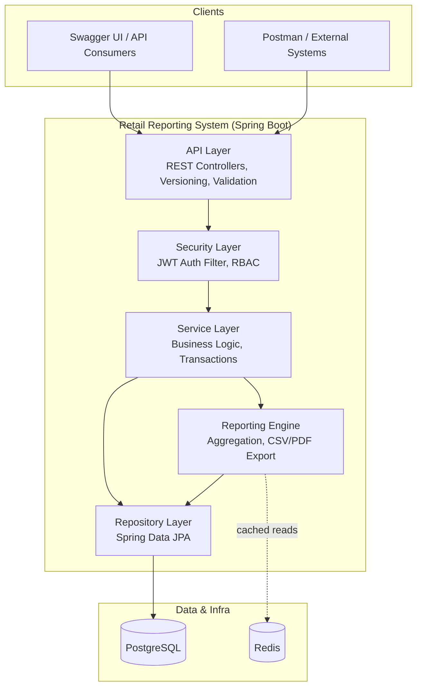
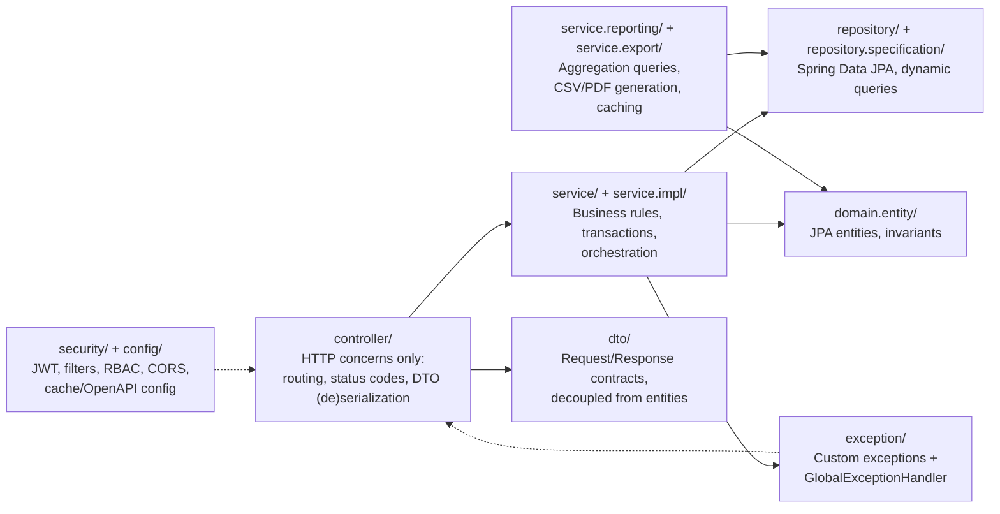
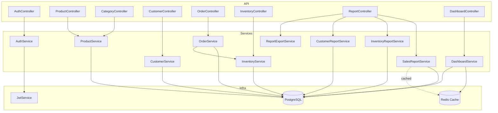
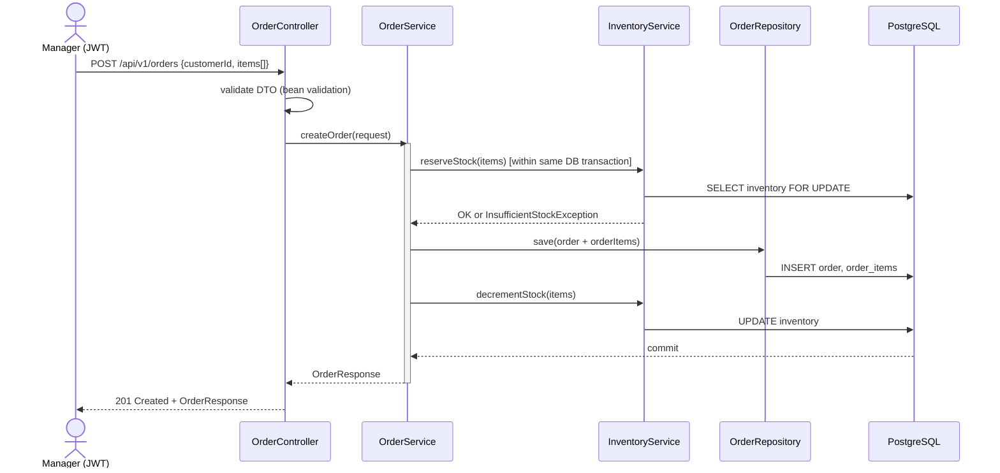
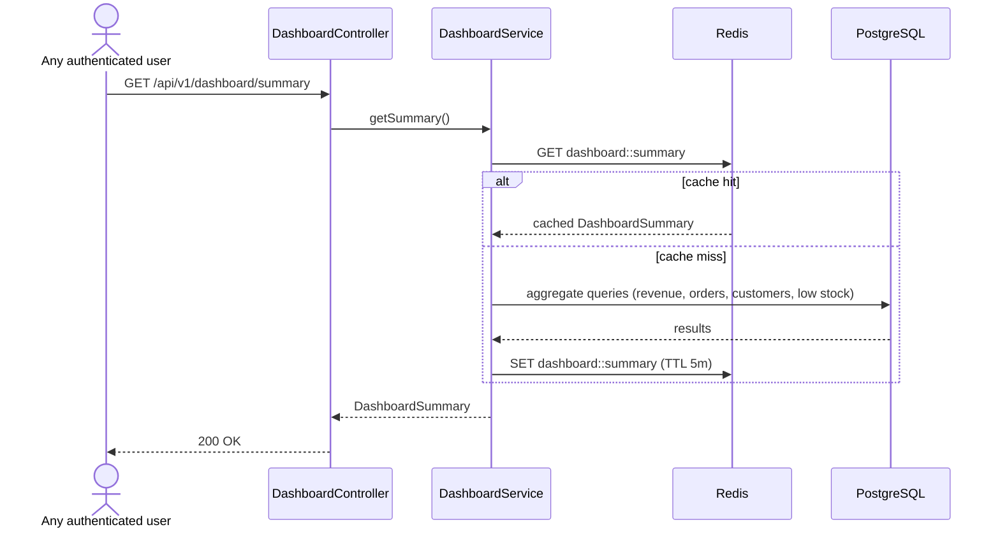
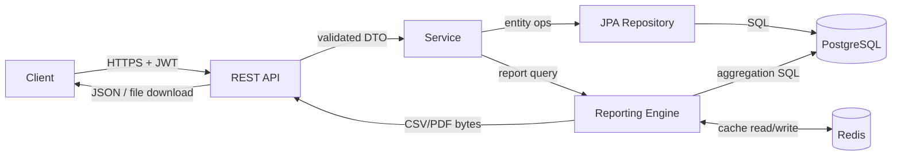
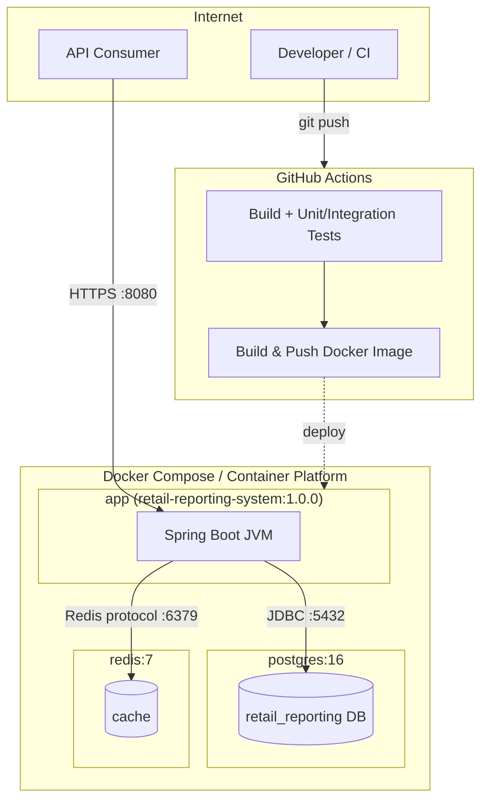
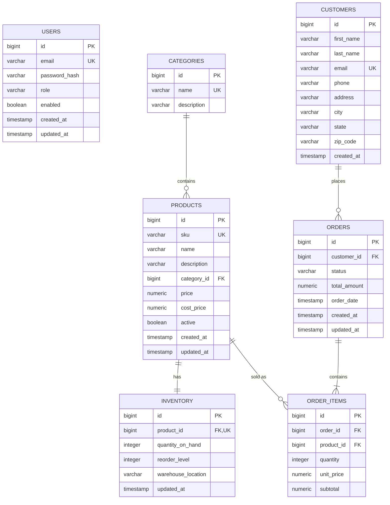

# Architecture

## 1. Architectural Style

The system is a **modular monolith** with a strict **layered architecture**
(Controller → Service → Repository → Database). A monolith was chosen over microservices
deliberately (see §6, Decision Log) — at this scale, microservices would add operational
overhead (service discovery, distributed tracing, network calls in place of function
calls) with no corresponding benefit. The layering internally is designed so that a
future extraction into services (e.g., splitting the Reporting module out) would follow
existing seams (`service/reporting/*`) rather than requiring a rewrite.

## 2. High-Level Architecture

**Why this shape:** the API layer never talks to the database directly, and the
reporting engine is a peer of the core service layer (not bolted onto controllers) so
it can be tested and cached independently of CRUD business logic.

## 3. Layered Architecture (Package Responsibilities)

**Rule enforced throughout the codebase:** controllers depend on services and DTOs
only — never on repositories or entities directly. This keeps persistence details
(and any future ORM change) from leaking into the API contract.

## 4. Component Diagram

## 5. Sequence Diagram — Place an Order

If stock reservation fails, the whole transaction rolls back — the order is never
persisted in a partially-applied state (see §7, Transaction Boundaries).

## 6. Sequence Diagram — Cached Dashboard Read

## 7. Data Flow Diagram

## 8. Deployment Diagram

Target hosts documented in `docs/deployment.md` include Render, Railway, and
AWS ECS/Azure Container Apps — all consume the same Docker image, differing only
in environment variable configuration.

## 9. Entity-Relationship Diagram

Full column-level documentation, constraints, and index rationale live in
[`docs/database.md`](./database.md).

## 10. Transaction Boundaries

- `OrderService.createOrder()` is `@Transactional`: stock check, stock decrement, order
  insert, and order-item inserts commit or roll back together.
- Report queries are read-only transactions (`@Transactional(readOnly = true)`), which
  lets the JPA/Hibernate session skip dirty-checking overhead for large aggregation reads.
- Inventory adjustments use a pessimistic row lock (`SELECT ... FOR UPDATE` via
  `@Lock(LockModeType.PESSIMISTIC_WRITE)`) to prevent overselling under concurrent order
  placement.

## 11. Decision Log

| Decision | Alternatives Considered | Why This Choice |
|---|---|---|
| Modular monolith | Microservices | Team-of-one project at this data volume; monolith is faster to build, test, and deploy correctly. Package boundaries mirror likely future service boundaries. |
| PostgreSQL | MySQL, MongoDB | Strong relational integrity (FKs, constraints) fits normalized retail data; window functions and CTEs simplify reporting SQL; MongoDB would fight the inherently relational domain. |
| JWT (stateless) | Server-side sessions | Enables horizontal scaling without sticky sessions or a shared session store. |
| Redis for caching | In-memory (Caffeine) only | Cache survives app restarts/multi-instance deployments; Caffeine noted in ROADMAP as an optional local L1 cache in front of Redis. |
| DTOs separate from entities | Expose entities directly | Prevents accidental over-fetching/serialization of sensitive fields (e.g., password hash) and decouples API contract from schema changes. |
| Flyway migrations | Hibernate `ddl-auto=update` | Explicit, versioned, reviewable schema changes; `ddl-auto` is disabled entirely outside tests. |
| openhtmltopdf for PDF export | iText | Permissive license (LGPL/MIT-style), sufficient for HTML-templated report rendering without commercial licensing concerns. |
